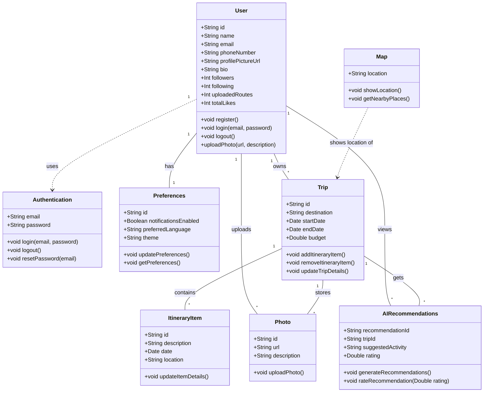

# Modelo de Datos de Roamly  

## Introducción  
Este documento describe el modelo de datos para una aplicación de agencia de viajes. El modelo está diseñado para gestionar usuarios, sus viajes, itinerarios, preferencias y recomendaciones impulsadas por IA. También incluye funcionalidades de autenticación y mapeo. 

## Diagrama de clases 
El siguiente diagrama de clases en Mermaid representa las relaciones entre las diferentes entidades del sistema:

A nivel de arquitectura hemos tomado las siguientes decisiones:
    - Hemos dividido nuestra barra inferior en tres botones principales.
    1. Explorar:
        Hemos considerado importante para una app de planificación de viajes mostrar en primer
        lugar el mapa que situa al usuario en su posición actual y en fases más avanzadas del 
        desarrollo del proyecto que muestre las ubicaciones de sus viajes anteriores y sus viajes
        futuros (diferenciados por una leyenda de colores).
        Con esta decisión queremos incentivar a los usuarios a viajar y a completar el mapa 
        como si de un mapa físico colgado en la pared se tratara.

    2. Search: 
        Queremos que el usuario este conectado con otros viajeros y pueda interactuar con 
        ellos asimismo pudiendo visualizar los viajes realizados por otros usuarios y
        mediante el número de teléfono poder contactar.
        A parte, también podrá buscar nuevos destinos y añadirlos en su mapa.

    3. Profile: 
        Cada usuario debe tener fácil acceso a su perfil en el cual se encuentran diferentes
        informaciones como sus viajes anteriores, su lista de deseos...
        En esta pantalla el usuario podrá personalizar su perfil (nombre de usuario, correo y 
        foto de perfil en un futuro) y configurar la aplicación a su gusto (idioma, tema y notificaciones) 
        y hacer consultas sobre la app.

