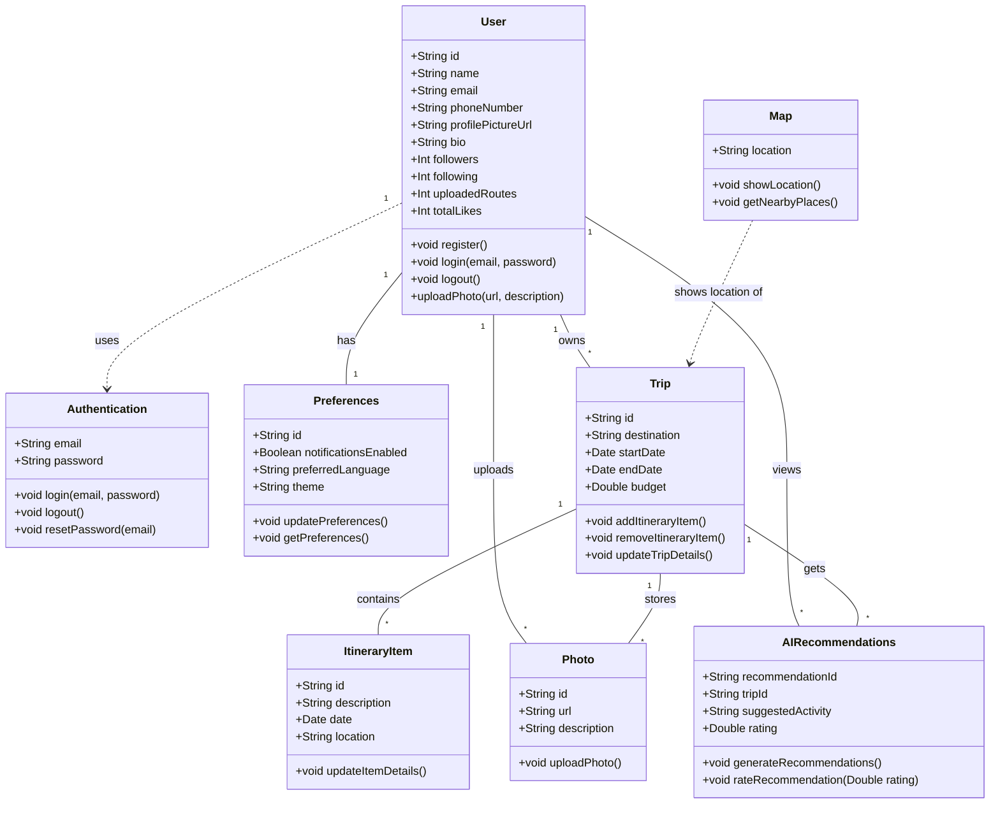

# Modelo de Datos de Roamly  

## Introducción  
Este documento describe el modelo de datos para una aplicación de agencia de viajes. El modelo está diseñado para gestionar usuarios, sus viajes, itinerarios, preferencias y recomendaciones impulsadas por IA. También incluye funcionalidades de autenticación y mapeo. 

## Diagrama de clases 
El siguiente diagrama de clases en Mermaid representa las relaciones entre las diferentes entidades del sistema:

## **Decisiones Arquitectónicas**

Para el diseño de la aplicación, hemos tomado diversas decisiones arquitectónicas con el objetivo de ofrecer una experiencia fluida e intuitiva al usuario.

### **📌 Estructura de la Barra de Navegación Inferior**

Hemos dividido la barra inferior en **tres secciones principales**, cada una con un propósito específico dentro de la planificación y exploración de viajes.

### **1️⃣ Explorar**
📍 **Funcionalidad actual**:
- Muestra un **mapa interactivo** que posiciona al usuario en su ubicación actual.

🌍 **Futuras implementaciones**:
- Visualización de **viajes anteriores** y **próximos viajes**, diferenciados mediante una leyenda de colores.
- Incentivar a los usuarios a viajar al **completar su propio mapa**, como si fuera un **mapa físico colgado en la pared**.

---

### **2️⃣ Buscar**
🔍 **Objetivo**: Conectar a los usuarios con otros viajeros y facilitar la exploración de destinos.

💬 **Características principales**:
- **Interacción con otros usuarios**, permitiendo visualizar los viajes que han realizado.
- Contacto a través del **número de teléfono** para intercambiar experiencias y recomendaciones.
- Posibilidad de **buscar nuevos destinos** y agregarlos a su mapa personal.

---

### **3️⃣ Perfil**
👤 **Acceso rápido y personalización**

📌 **Funciones actuales**:
- Visualización de **viajes anteriores** y **lista de deseos**.

⚙️ **Configuraciones disponibles**:
- Personalización del perfil (**nombre de usuario, correo y foto de perfil en el futuro**).
- Ajustes de la aplicación:
    - **Idioma** 🌎
    - **Tema** 🎨
    - **Notificaciones** 🔔
- Sección de **consultas sobre la app** y su funcionamiento.

---

### **🎯 Conclusión**
Con esta estructura, buscamos que la aplicación sea intuitiva, inspiradora y funcional, permitiendo que los usuarios **descubran nuevos destinos, se conecten con otros viajeros y personalicen su experiencia**. 🚀🌍  
